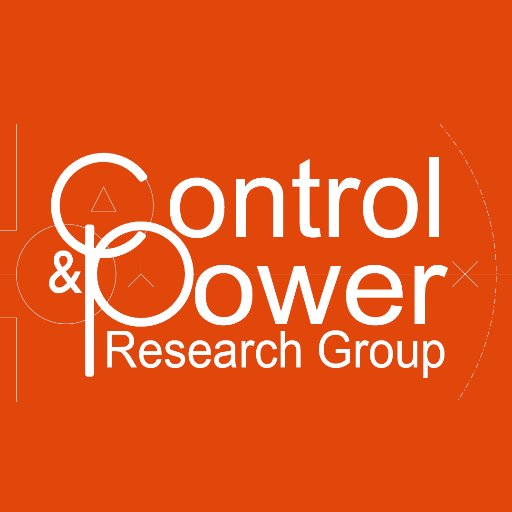

<p float="left">
    
     
    
    
</p>

# Multi-Agent Reinforcement Learning for Active Voltage Control on Power Distribution Networks (MAPDN)

This is the implementation of the paper [Multi-Agent Reinforcement Learning for Active Voltage Control on Power Distribution Networks](https://arxiv.org/abs/2110.14300).

**MAPDN** is an environment of distributed/decentralised active voltage control on power distribution networks and a batch of state-of-the-art multi-agent actor-critic algorithms that can be used for training.

The environment implementation follows the multi-agent environment framework provided in [PyMARL](https://github.com/oxwhirl/pymarl/). Therefore, all baselines that are compatible with that framework can be easily applied to this environment.

<br />

## Summary of the Repository

This repository includes the following components.

* An environment of active voltage control (decentralised and distributed);

* A training framework for MARL;

* 10 MARL algorithms;

    * [IAC](https://arxiv.org/abs/1907.05707), [IDDPG](https://arxiv.org/abs/1907.05707), [MADDPG](https://arxiv.org/abs/1706.02275), [SQDDPG](https://arxiv.org/abs/1907.05707), [IPPO](https://arxiv.org/abs/2011.09533), [MAPPO](https://arxiv.org/abs/2103.01955), [MAAC](http://proceedings.mlr.press/v97/iqbal19a.html), [MATD3](https://arxiv.org/abs/1910.01465), [COMA](https://ojs.aaai.org/index.php/AAAI/article/view/11794), and [FacMADDPG](https://arxiv.org/abs/2003.06709).

* 5 voltage barrier functions;

    * Bowl, L1, L2, Courant Beltrami, and Bump.

* Implementation of droop control and OPF in Matlab.

<br />

## A Brief Introduction of the Task

In this section, we give a brief introduction of this task so that the users can easily understand the objective of this environment. 

**Objective:** Each agent controls a PV inverter that generates the reactive power so that the voltage of each bus is varied and within the safety range defined as $0.95 \ p.u. \leq v_{k} \leq 1.05 \ p.u., \ \forall k \in V$, where $V$ is the set of buses of the whole system and $p.u.$ is a unit to measure voltage. Since each agent's decision could influence each other due to property of power networks and not all buses is installed a PV, agents should cooperate to control the voltage of all buses in a power network. Also, each agent can only observe the partial information as the observation. This problem is natually a Dec-POMDP.

**Action:** The reactive power is constrained by the capacity of the equipment, and the capacity is related to the active power of PV. As a result, the range of reactive power is dynamically varied. Mathematically, the reactive power of each PV inverter is represented as $$q_{k}^{\scriptscriptstyle PV} = a_{k} \ \sqrt{(s_{k}^{\scriptscriptstyle \max})^{2} - (p_{k}^{\scriptscriptstyle PV})^{2}},$$ where $s_{k}^{\scriptscriptstyle \max}$ is the maximum apparent power of the $k\text{th}$ node that is dependent on the physical capacity of the PV inverter; $p_{k}^{\scriptscriptstyle PV}$ is the instantaneous PV active power. The action we control is the variable $0 \leq a_{k} \leq 1$, indicating the percentage of the intantaneous capacity of reactive power. For this reason, the action is continuous in this task.

**Observation:** Each agent can observe the information of the zone where it belongs. For example, in Figure 1 the agent on bus 25 can observe the information in zone 3. Each agent's observation consists of the following variables within the zone:

* Load Active Power,
* Load Reactive Power,
* PV Active Power,
* PV Reactive Power,
* Voltage.


<figure>
  <br />
  
  <figcaption>
    Figure 1: Illustration on the 33-bus network. Each bus is indexed by a circle with a number. Four control regions are partitioned by the smallest path from the terminal to the main branch (bus 1-6). We control the voltage on bus 2-33 whereas bus 0-1 represent the substation with constant voltage and infinite active and reactive power capacity. G represents an external generator; small Ls represent loads; and emoji of sun represents the location where a PV is installed.
  </figcaption>
  <br /> <br />
</figure>

**Reward:** The reward function is shown as follows:
$$\mathit{r} = - \frac{1}{|V|} \sum_{i \in V} l_{v}(v_{i}) - \alpha \cdot l_{q}(\mathbf{q}^{\scriptscriptstyle PV}),$$
where $l_{v}(\cdot)$ is a voltage barrier function that measures whether the voltage of a bus is within the safety range; $l_{q}(\mathbf{q}^{\scriptscriptstyle PV})=\frac{1}{|\mathcal{I}|}||\mathbf{q}^{\scriptscriptstyle PV}||\_{1}$ that can be seen as a simple approximation of power loss, where $\mathbf{q}^{\scriptscriptstyle PV}$ is a vector of agents' reactive power, $\mathcal{I}$ is a set of agents and $\alpha$ is a multiplier to adjust the balance between voltage control and the generation of reactive power. In this work, we investigate different forms of $l_{v}(\cdot)$. Literally, the aim of this reward function is controlling the voltage, meanwhile minimising the power loss that is correlated with the economic loss.

<br />

## Installation of the Dependencies

1. Install [Anaconda](https://www.anaconda.com/products/individual#Downloads).
2. After cloning or downloading this repository, assure that the current directory is `[your own parent path]/MAPDN`.
3. If you are on Linux OS (e.g. Ubuntu), please execute the following command. 
   ```bash
   conda env create -f environment.yml
   ```
   If you are on Windows OS, please execute the following command. 
   ```bash
   conda env create -f environment_win.yml
   ```
4. Activate the installed virtual environment using the following command.
    ```bash
    conda activate mapdn
    ```

<br />

## Downloading the Dataset

1. Download the data from the [link](https://drive.google.com/file/d/1ry0-K5M-YMw7TcQQYeFb7U-pYvdWKm9A/view?usp=sharing).
2. Unzip the zip file and you can see the following 3 folders:

    * `case33_3min_final`
    * `case141_3min_final`
    * `case322_3min_final`
3. Go to the directory `[Your own parent path]/MAPDN/environments/var_voltage_control/` and create a folder called `data`.
4. Move the 3 extracted folders by step 2 to the directory `[Your own parent path]/MAPDN/environments/var_voltage_control/data/`.

<br />

## Two modes of Tasks

### Background

There are 2 modes of tasks included in this environment, i.e. distributed active voltage control and decentralised active voltage control. Distributed active voltage control is the task introduced in the paper [Multi-Agent Reinforcement Learning for Active Voltage Control on Power Distribution Networks](https://arxiv.org/abs/2110.14300), whereas Decentralised active voltage control is the task that most of the prior works considered. The primary difference between these 2 modes of tasks are that in decentralised active voltage control the equipments in each zone are controlled by an agent, while in distributed active voltage control each equipment is controlled by an agent (see Figure 1).

### How to use?

If you would attempt distributed active voltage control, you can set the argument for `train.py` and `test.py` as follows.

```bash
python train.py --mode distributed
```

```bash
python test.py --mode distributed
```

If you would attempt decentralised active voltage control, you can set the argument for `train.py` and `test.py` as follows.

```bash
python train.py --mode decentralised
```

```bash
python test.py --mode decentralised
```

<br />

## Quick Start

### Training Your Model

You can execute the following command to train a model on a power system using the following command.

```
python train.py --alg matd3 --alias 0 --mode distributed --scenario case33_3min_final --voltage-barrier-type l1 --save-path trial
```

The the meanings of the arguments are illustrated as follows:
* `--alg` indicates the MARL algorithm you would like to use.
* `--alias` is the alias to distinguish different experiments.
* `--mode` is the mode of the envrionment. It contains 2 modes, e.g. distributed and decentralised. Distributed mode is the one introduced in this work, whereas decentralised mode is the traditional environment used by the prior works.
* `--scenario` indicates the power system on which you would like to train.
* `--voltage-barrier-type` indicates the voltage barrier function you would like to use for training.
* `--save-path` is the path you would like to save the model, tensorboard and configures.

### Testing Your Model

After training, you can exclusively test your model to do the further analysis using the following command.

```
python test.py --save-path trial/model_save --alg matd3 --alias 0 --scenario case33_3min_final --voltage-barrier-type l1 --test-mode single --test-day 730 --render
```

The the meanings of the arguments are illustrated as follows:
* `--alg` indicates the MARL algorithm you used.
* `--alias` is the alias you used to distinguish different experiments.
* `--mode` is the mode of the envrionment you used to train your model.
* `--scenario` indicates the power system on which you trained your model.
* `--voltage-barrier-type` indicates the voltage barrier function you used for training.
* `--save-path` is the path you saved your model. You just need to give the parent path including the directory `model_save`.
* `--test-mode` is the test mode you would like to use. There are 2 modes you can use, i.e. `single` and `batch`. 
* `--test-day` is the day that you would like to do the test. Note that it is only activated if the `--test-mode` is `single`.
* `--render` indicates activating the rendering of the environment.

<br />

## Interaction with Environment

The simple use of the environment is shown as the following codes.

```python
state, global_state = env.reset()

for t in range(240):
    actions = agents.get_actions(state) # a vector involving all agents' actions
    reward, done, info = env.step(actions)
    next_state = env.get_obs()
    state = next_state
```

<br />

## Reproduce the Results in the Paper

Users can easily reproduce the results shown in the paper by running the bash script provided with the default configures provided in this repository, e.g.,
```bash
source train_case33.sh 0 l1 reproduction
```
```bash
source train_case33.sh 0 l2 reproduction
```
```bash
source train_case33.sh 0 bowl reproduction
```
```bash
source train_case141.sh 0 l1 reproduction
```
```bash
source train_case141.sh 0 l2 reproduction
```
```bash
source train_case141.sh 0 bowl reproduction
```
```bash
source train_case322.sh 0 l1 reproduction
```
```bash
source train_case322.sh 0 l2 reproduction
```
```bash
source train_case322.sh 0 bowl reproduction
```

The arguements of the above bash scripts are as follows.
```bash
$1: --alias
$2: --voltage-barrier-type
$3: --save-path
```

**Note**: these training scripts are based on the assumption that you have **at least** 2 GPUs with 12 GB memory. If the above conditions do not satisfy your own local situation, please manually modify the allocation of GPUs. The results in the paper are produced by Geforce RTX 2080Ti.

<br />

## Brief Introduction of Scenarios

We show the basic settings of all scenarios provided in this repository.

| Scenario | No. Loads | No. Regions | No. PVs (Agents) | $p_{\text{max}}^{\scriptscriptstyle{L}}$ | $p_{\text{max}}^{\scriptscriptstyle{PV}}$ |
| -------- | -------- | -------- | -------- | -------- | -------- |
| Case33     | 32     | 4     | 6     | 3.5 MW | 8.75 MW |
| Case141     | 84     | 9     | 22     | 20 MW | 80 MW |
| Case322     | 337     | 22     | 38     | 1.5 MW | 3.75 MW |


<br />

## Traditional Control

### Downloading Date

1. Download the data from the [link](https://drive.google.com/file/d/1UOzhcQu-1v5GgW_p-TJewZloV5Di8dPA/view?usp=sharing).
2. Extract the case files and move them to the directory `[Your own parent path]/MAPDN/traditional_control`.

### Running

The traditional control methods are implemented by Matlab, empowered by [MATPOWER](https://matpower.org/). Please ensure that the latest version of MATPOWER is installed before the next execution.

* Reproduce the results for droop control by running the file `pf_droop_matpower_all.m`.

* Reproduce the results for OPF by running the file `opf_matpower_all.m`.

See the annotation in the files for more details.


<br />

## API Usage

For more details of this environment, users can check the [API Docs](https://github.com/Future-Power-Networks/MAPDN/wiki/Environments).

<br />

## Citation

If you would use this environment or part of this work, please cite the following paper.

```
@misc{wang2021multiagent,
      title={Multi-Agent Reinforcement Learning for Active Voltage Control on Power Distribution Networks}, 
      author={Jianhong Wang and Wangkun Xu and Yunjie Gu and Wenbin Song and Tim C. Green},
      year={2021},
      eprint={2110.14300},
      archivePrefix={arXiv},
      primaryClass={cs.LG}
}
```
<br />

## Contact

If you have any issues or any intention of cooperation, please feel free to contact me via `jianhong.wang16@imperial.ac.uk`.

